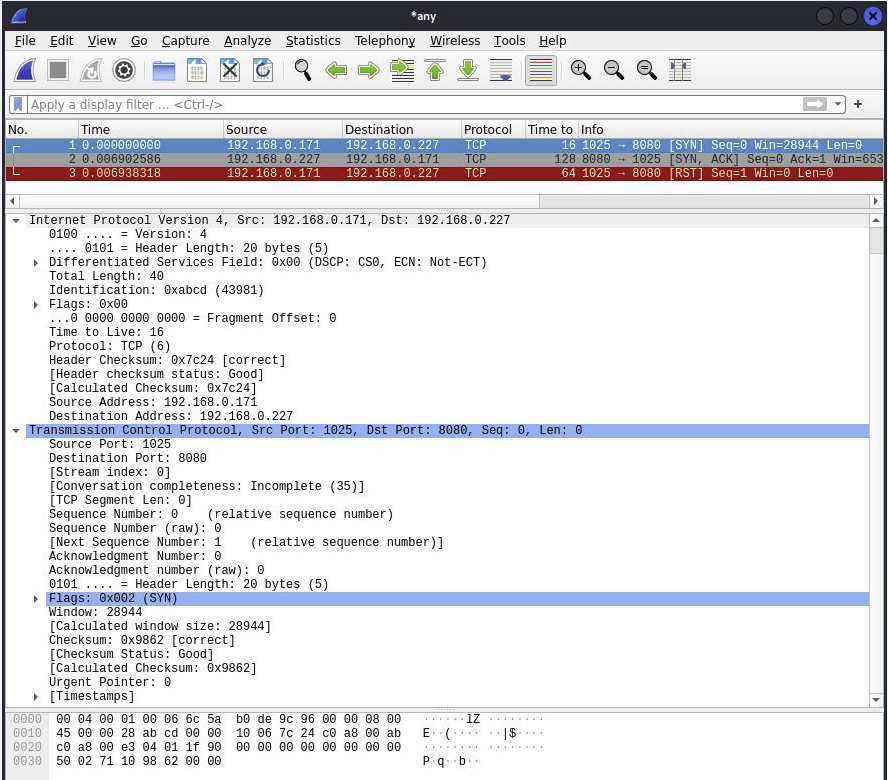

# Raw TCP/IP packet
> Create raw TCP/IP packets and send it through your network.

## Table of Contents
* [General Info](#general-information)
* [Wireshark](#wireshark)
* [Usage](#usage)
* [Acknowledgments](#acknowledgements)

## General Information
- The puropse of this project is better understanding how TCP and IP packets are created and 
what mean those numbers when catching it with Wireshark.

## Usage
Open Linux terminal and type:

`$ python -m http.server --bind 127.0.0.1 9000 `

This command opens local server on port 9000

Run Wireshark and open another terminal window in project directory and type:

`$ make`

After compiling run with arguments:

`$ ./TCPIP_packet 192.168.137.156  127.0.0.1  16 1025 9000  000000010`

the output is raw hexadecimal TCP/IP packet:

`4500 0028 abcd 0000 1006 35bd c0a8 899c 7f00 0001 0401 2328 0000 0000 0000 0000 5002 7110 4e63 0000`

 and destination ip number:
 
`127.0.0.1`

The arguments are: 

`./TCPIP_packet source_ip destination_ip TTL source_port destination_port tcp_flags`

You can pipe it with Python script ( sudo is required, because it operates on raw sockets):

`$ ./TCPIP_packet 192.168.137.156  127.0.0.1  16 1025 9000  000000010 | sudo python send.py`

The packet is created and send from ip: `192.168.137.156`, port: `1025` with TTL: `16` to destination ip: `127.0.0.1 (localhost)`, 
on port: `9000` and SYN flag set.

## Wireshark
Catching packets with Wireshark. 
Here is example of starting three-way-handshake.

1. Packet with SYN is send from local machine (client) to local server
2. The server responds with SYN, ACK
3. The client responds with RST flag beacuse this is not full TCP connection.

## Acknowledgements
Give credit here.
- This project was based on [this tutorial](https://inc0x0.com/tcp-ip-packets-introduction/tcp-ip-packets-3-manually-create-and-send-raw-tcp-ip-packets/).
- IMPORTANT: Use this only on network which you own, you don't want to get into trouble.
